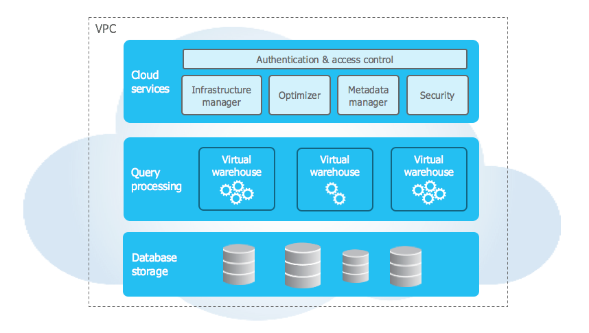

AnalyticDB阿里云
# 整体架构

图1展示了Snowflake的整体架构。Snowflake设计的最终目的是为用户提供高易用性、高可操作性，以及高可靠性，基于这样的前提，Snowflake的内核组件的设计都具有高可靠、高可扩展的特性。组件是互相独立的，组件之间通过RESTful接口进行通信。Snowflake内核组件从底向上可以分为三个层面：

1）**数据存储**。Snowflake的数据存储是构建在Amazon S3存储服务至上，主要用来存储表数据和查询结果。

2）**虚拟仓库**。虚拟仓库构建在Amazon EC2虚拟机组成的弹性集群之上，负责执行用户的查询请求。

3）**云服务组件**。云服务组件是Snowflake的大脑，它包括并发访问控制、基础设施管理、优化器、事务管理、安全管理、元数据管理，其中元数据包含schema信息、表信息、权限认证信息、秘钥、统计信息等。

## SNOWFLAKE简介
Snowflake 是真正的 SaaS 产品。进一步来说：

-   没有硬件（虚拟或物理）可供选择、安装、配置或管理。
-   几乎没有软件可以安装、配置或管理。
-   持续的维护、管理、升级和调整由 Snowflake 处理。

Snowflake 完全在云基础架构上运行。Snowflake 服务的所有组件（除了可选的命令行客户端、驱动程序和连接器）都在公共云基础架构中运行。

Snowflake 使用虚拟计算实例来满足其计算需求，并使用存储服务来持久存储数据。Snowflake 不能在私有云基础架构（本地或托管）上运行。

Snowflake 不是用户可以安装的打包软件产品。Snowflake 管理软件安装和更新的所有方面。

## 架构

Snowflake 的架构是传统共享磁盘和无共享数据库架构的混合体。与共享磁盘架构类似，Snowflake 使用中央数据存储库来存储可从平台中的所有计算节点访问的持久数据。但与无共享架构类似，Snowflake 使用 MPP（大规模并行处理）计算集群处理查询，其中集群中的每个节点在本地存储整个数据集的一部分。这种方法提供了共享磁盘架构的数据管理简单性，但具有无共享架构的性能和横向扩展优势。



### 数据库存储

当数据加载到 Snowflake 中时，Snowflake 会将该数据重新组织为其内部优化、压缩的列格式。Snowflake 将这些优化的数据存储在云存储中。

Snowflake 管理数据存储方式的所有方面——组织、文件大小、结构、压缩、元数据、统计数据以及数据存储的其他方面由 Snowflake 处理。Snowflake 存储的数据对象不直接可见，客户无法访问；它们只能通过使用 Snowflake 运行的 SQL 查询操作来访问。

### 查询处理

查询执行在处理层执行。Snowflake 使用“虚拟仓库”处理查询。每个虚拟仓库都是一个 MPP 计算集群，由 Snowflake 从云提供商分配的多个计算节点组成。

每个虚拟仓库都是一个独立的计算集群，不与其他虚拟仓库共享计算资源。因此，每个虚拟仓库对其他虚拟仓库的性能没有影响。

有关详细信息，请参阅[虚拟仓库](https://docs.snowflake.com/en/user-guide/warehouses.html)。

### 云服务

云服务层是协调跨雪花活动的服务集合。这些服务将 Snowflake 的所有不同组件联系在一起，以处理从登录到查询调度的用户请求。云服务层还运行在 Snowflake 从云提供商处提供的计算实例上。

该层管理的服务包括：

-   验证
-   基础设施管理
-   元数据管理
-   查询解析和优化
-   访问控制


## 连接到雪花

Snowflake 支持多种连接服务的方式：

-   一个基于 Web 的用户界面，可以从中访问管理和使用 Snowflake 的所有方面。
-   命令行客户端（例如 SnowSQL）也可以访问管理和使用 Snowflake 的所有方面。
-   其他应用程序（例如 Tableau）可以使用 ODBC 和 JDBC 驱动程序连接到 Snowflake。
-   可用于开发连接到 Snowflake 的应用程序的本机连接器（例如 Python、Spark）。
-   第三方连接器，可用于将 ETL 工具（例如 Informatica）和 BI 工具（例如 ThoughtSpot）等应用程序连接到 Snowflake。
- 
# JDBC 驱动程序

## JDBC 驱动程序连接字符串

``` 
jdbc:snowflake://<account_identifier>.snowflakecomputing.com/?<connection_params>
```

`<account_identifier>`

指定您的 Snowflake 帐户的帐户标识符。有关详细信息，请参阅[帐户标识符](https://docs.snowflake.com/en/user-guide/admin-account-identifier.html)。有关 JDBC 连接字符串中使用的帐户标识符的示例，请参阅[示例](https://docs.snowflake.com/en/user-guide/jdbc-configure.html#label-other-jdbc-connection-string-examples)。

`<connection_params>`

以 的形式指定一系列一个或多个[JDBC 连接参数](https://docs.snowflake.com/en/user-guide/jdbc-parameters.html) 和[会话参数](https://docs.snowflake.com/en/sql-reference/parameters.html)，`<param>=<value>`每个参数由 & 字符 ( `&`) 分隔，并且连接字符串中的任何位置都没有空格。

### 例子[](https://docs.snowflake.com/en/user-guide/jdbc-configure.html#examples "固定链接到这个标题")

以下是使用 [帐户标识符的连接字符串示例，该帐户标识符](https://docs.snowflake.com/en/user-guide/admin-account-identifier.html)指定`myaccount`组织中 的帐户`myorganization`。

> jdbc:snowflake://myorganization-myaccount.snowflakecomputing.com/?user=peter&warehouse=mywh&db=mydb&schema=public

以下是使用[帐户定位符](https://docs.snowflake.com/en/user-guide/admin-account-identifier.html#label-account-locator) `xy12345`作为帐户标识符的连接字符串示例：

> jdbc:snowflake://xy12345.snowflakecomputing.com/?user=peter&warehouse=mywh&db=mydb&schema=public
